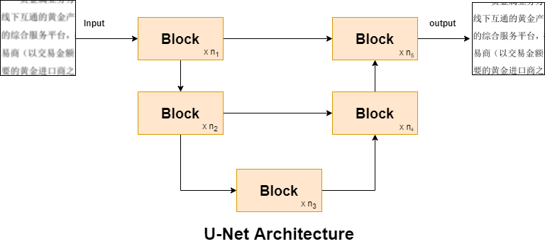
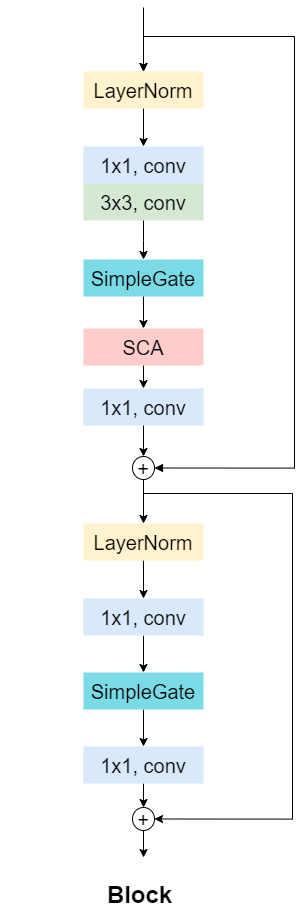

# 百度网盘AI大赛-模糊文档图像恢复赛第8名方案
## 1.总体架构
本模糊文档图像恢复方案编码采用基于PaddlePaddle的PaddleGAN代码框架，选取NAFNet[1]算法网络作为基线网络。NAFNet总体架构采用类U-Net结构，相比于其他复杂交互方式，简洁有效，减少计算成本。

<p align="center">
  
</p>

NAF-Net基线网络的Block模块由LayerNorm、1x1卷积、3x3卷积、SimpleGate机制、SCA简化通道注意力模块组成, Block模块如下图所示。

<p align="center">
  
</p>

## 2. 网络改进调整策略
1. 为了减少网络参数，提高运算效率，我们对原先NAF-Net网络的Encoder编码器和Decoder解码器的Block数量进行调整，Encoder四个阶段的Block堆叠数量设置为[1,1,1,28], Decoder四个阶段的Block堆叠数量设置为[1,1,1,1]，中间Block数量设置为1，处理特征图通道数由64调整为32。

2. 由于本比赛输入的模糊文档图像尺寸较大，需要进行分patch处理。因为不同图像patch会影响图像分布数据不同，为了减少训练和推理阶段处理的patch尺度不同导致网络性能的下降，我们在推理阶段采用测试时间本地统计转换器TLSC[2]。该方案不需要对模型重新训练或微调，在推理阶段从全局替换为局部进行统计聚合操作。

## 3. 数据处理策略
1. 为了减少显存占用，训练阶段对输入图像pair随机裁剪512*512的patch，并采用随机水平、垂直翻转方式进行数据增强。

2. 为了保证修复效果和减少计算时间, 测试阶段对图像进行1024*1024的patch分块进行处理，最后再进行拼接。选取1024*1024的patch，是考虑到分块512*512patch会导致处理数量剧增，总推理时间更长，不如1024*1024patch。


## 4. 训练策略及参数
1. 网络采用PSNRLoss作为损失函数，迭代20w次iteration，batch_size设置为2，学习率lr设置为0.003，采用退火余弦策略调整学习率，采用AdamW优化器，beta1和beta2设置为0.9。

2. 训练加载基于GoPro去模糊数据集训练的预训练模型，验证采用数据集的train_data_10部分作为本地验证集，最终提交结果为在本地验证集效果较好的迭代196000次的checkpoint。


## 5. 代码结构介绍 
> config  
> &emsp;|-----mynafnet.yaml  #参数配置文件
> ppgan  
> &emsp;|-----models
>
> ​        |-----generators
>
> ​            |-----nafnet.py #网络定义文件
>
> ​        |-----nafnet_model.py #网络训练及测试配置文件
>
> submit
>
> &emsp;|-----predict.py  #提交预测文件
>
> tools
>
> &emsp;|-----main.py  #训练启动文件


## 6. 执行命令

1. 安装运行环境

   ```
   pip install -r requirements.txt
   ```

2. 训练命令

   ```
   python tools/main.py --config-file configs/mynafnet.yaml --load pretrained/NAFNet-GoPro-width32.pdparams
   ```
3. 预测命令

   ```
   cd submit
   python predict.py
   ```

## 7. 模型下载
1. 预训练权重

   百度云盘链接：https://pan.baidu.com/s/1xwQGr6vTBf6-lKq3l6rHSQ 
   提取码：2156

2. 比赛最终提交权重

   百度云盘链接：https://pan.baidu.com/s/1wo_r6WXpC9tli_VaqZLvig 
   提取码：2156

   下载后放在submit文件夹下，和predict.py文件同级。
